# Horos cards for Home Assistant

Twenty-six Lovelace cards that pack several entities into a single tile — grouped by
device or by meaning.

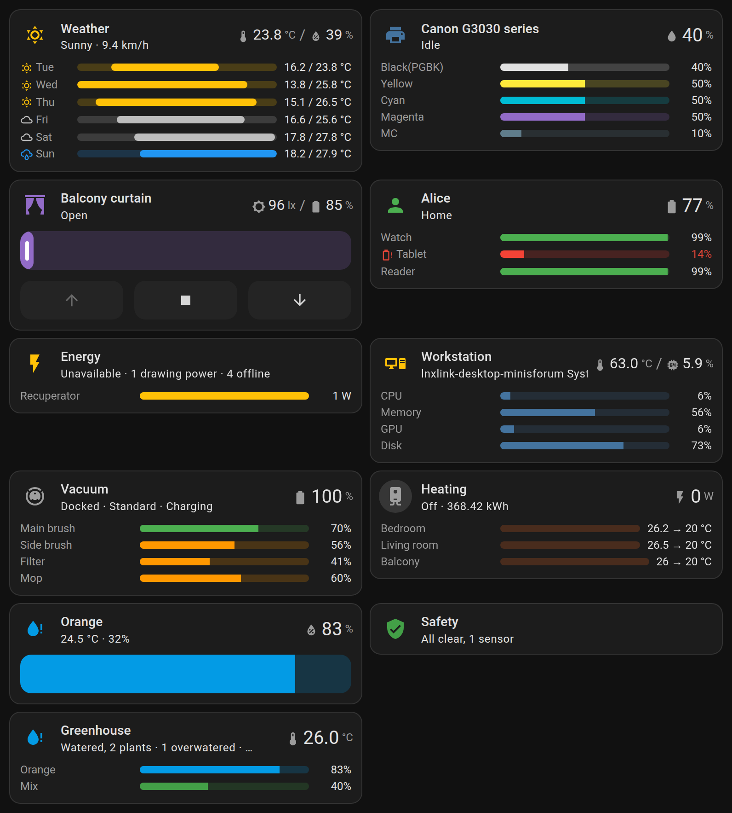

[](https://hacs.xyz/)
[](https://www.home-assistant.io/)
[](LICENSE)

## Why

One physical thing turns into a dozen entities in Home Assistant: a Zigbee plug gives
you 13, a robot vacuum 78, a computer reporting through lnxlink all 100. The stock tile
shows exactly one of them, so seeing the whole device means lining up five tiles in a
row.

These cards pull out of those entities the thing you actually look at the device for:
a printer — the level of every cartridge, a vacuum — its battery and how much life is
left in the consumables, a person — whether they are home and whether their watch is
about to die.

The cards are not a generic builder. The config says **which entity plays which role**,
and the card decides the layout itself.

## How it works

The cards **don't reimplement the stock tile's markup — they are assembled from its
components**: `ha-tile-container`, `ha-tile-icon`, `ha-tile-info`, `hui-card-features`.
Ripple, gesture recognition, the focus ring, `state_content`, stock features and all six
actions (tap/hold/double tap, and the same three on the icon) come from there too.

Only what the tile does not have is written here: the right-hand column of large values,
a separate tap target per value, and the level rows.

The interface and the editors are translated into English and Russian; the language
follows the user's Home Assistant setting.

The rationale behind the decisions, and the list of what is missing compared to the
stock tile, are in the [design spec](docs/superpowers/specs/2026-09-04-ha-tile-cards-design.md).

## Installation

HACS → ⋮ → Custom repositories → the address of this repository, category **Dashboard**.
Then "Install" and reload the page.

The built `dist/ha-plugins-cards.js` is committed to the repository, so no access to the
Home Assistant filesystem is needed.

Manually: drop `dist/ha-plugins-cards.js` into `config/www/` and add it under
Settings → Dashboards → ⋮ → Resources as a JavaScript module `/local/ha-plugins-cards.js`.

Every card shows up in the card picker, and each one has its own visual editor — writing
YAML is optional.

## Suggestions when adding a card

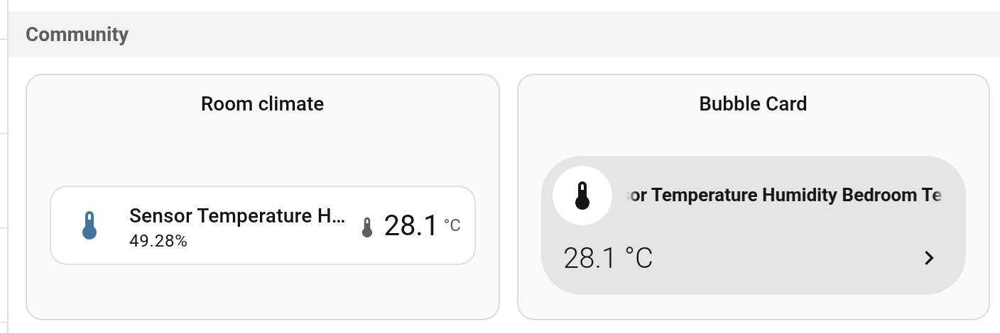

In edit mode, "Add card → By entity" asks every installed card what it would build
for the entity you picked, and the answers show up under "Community". These cards
answer, and the suggestion arrives already filled in: pick the bedroom temperature
sensor and you get a room card that has found the humidity on the same device; pick one
cartridge and you get the printer with all of its ink; pick any battery and you get the
card holding every battery in the house.

That is not the auto-detection the cards refuse to do. A suggestion is a draft rendered
in front of you and editable before it is added, and the rules behind it are objective —
domain, `device_class`, entity attributes, belonging to one device. Nothing is guessed
from names.

A card stays quiet when it would not say more than the stock tile: a lone temperature
sensor with nothing else on its device suggests nothing.

## Cards

The fields shared by every card (except `horos-buttons-tile`) are the stock tile's own:
`name`, `icon`, `color`, `vertical`, `hide_state`, `state_content`, `time_format`,
`features`, `features_position`, `tap_action`, `hold_action`, `double_tap_action` and the
same three actions on the icon.

Wherever a field takes a list, an item can be either an `entity_id` string or
`{entity, name, icon, color}` if you want your own label or row colour.

`big_values` picks which values move into the right-hand column in a large font (up to
three). `levels: false` drops the card's own line under the tile — the rows, or the
buttons on the lamp — and leaves the card as its top line and nothing else.

**Controls.** Everything a card puts under the line that Home Assistant already draws —
the cover's buttons and slider, the climate modes and target, the playback buttons, the
brightness slider, the plant's gauge — is a **feature**, and the card only supplies the
default list. They are added, reordered and removed in the editor's Features panel, the
same place a stock tile's features live; an empty list means none of them. The card fields
`controls`, `brightness` and `toggle_button` still work in old configs but are no longer
offered in the editor.

**Height.** The top line is always one row of the dashboard grid: give a card a fixed
height and the extra goes to what is under the line, not into the line itself. Rows spread
through it the way stock features do; buttons and sliders stay 42px, the same on every
card, and each of them asks for a row of its own. A card that has nothing under the line
keeps its one row and leaves the rest of the slot empty rather than growing an empty
body.

### Room — `horos-climate-tile`

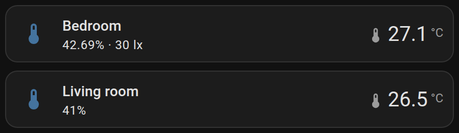

Temperature, humidity, illuminance and PM2.5 of a single room.

```yaml
type: custom:horos-climate-tile
name: Bedroom
temperature: sensor.bedroom_temperature
humidity: sensor.bedroom_humidity
illuminance: sensor.bedroom_illuminance
pm25: sensor.bedroom_pm25
big_values: [temperature]
```

### Weather — `horos-weather-tile`

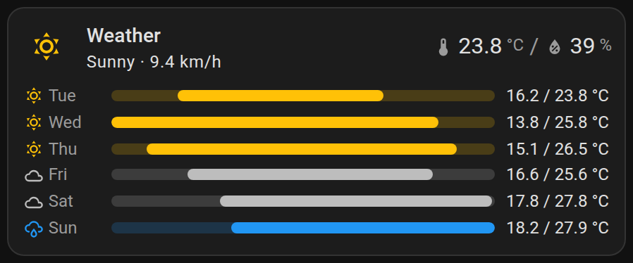

Today on the line — the condition and the wind, with the temperature and the humidity
large on the right — and the week under it, a row per day. The bar is a span from the
night to the afternoon, drawn against the whole week's range, so the warm stretch and the
cold one are visible before a single number is read; each day is painted in the colour of
its own condition, Home Assistant's own, and carries its icon.

A forecast is the one thing that is not in the state machine: HA streams it over the
websocket, so the card subscribes for it. An integration that has no daily forecast says
so on the line instead of leaving an empty half.

`bar` chooses what the bars measure: `temperature` (the default), `precipitation`,
`precipitation_probability`, `humidity` or `wind_speed`. Everything but temperature is a
level — a share of a hundred against a hundred, rain and wind against the week's largest.

```yaml
type: custom:horos-weather-tile
weather: weather.forecast_home
name: Weather
days: 7
bar: temperature
big_values:
  - temperature
  - humidity
```

### Lights — `horos-light-tile`

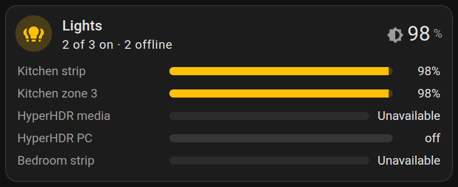

A room's lights in one tile: which of them are on and how bright. Every light is a row
whose bar is its brightness; a light that is off keeps its row, because the question is
what is on.

```yaml
type: custom:horos-light-tile
group: light.kitchen           # optional: a light group owns the line and the slider
lights:
  - entity: light.kitchen_strip
    name: Strip
  - light.kitchen_lamp
  - light.kitchen_spots
```

### Plug — `horos-plug-tile`

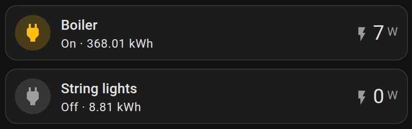

Switch, current power draw and accumulated energy. The icon toggles the plug; add the
stock `toggle` feature for a full-width button.

```yaml
type: custom:horos-plug-tile
switch: switch.boiler
power: sensor.boiler_power
energy: sensor.boiler_energy
```

### Plant — `horos-plant-tile`

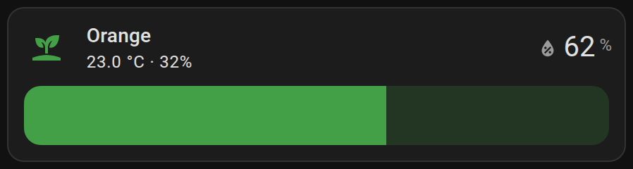

Soil moisture as a bar, with dry and overwatered thresholds (`dry_below`, `wet_above`).

```yaml
type: custom:horos-plant-tile
name: Orange tree
moisture: sensor.orange_moisture
temperature: sensor.orange_temperature
battery: sensor.orange_battery
dry_below: 25
```

### Greenhouse — `horos-greenhouse-tile`

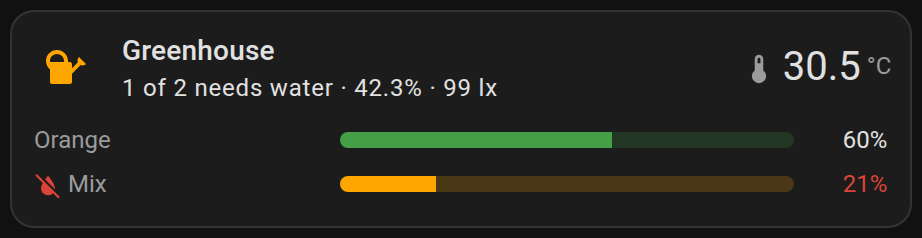

Every plant in one tile: a row each with soil moisture as the bar, coloured by that
plant's own dry and overwatered thresholds, and the line answering the one question worth
asking — how many need watering today. The air they share stands above them, because a
whole shelf drying out at once is usually about the room. A sensor that has gone quiet is
counted apart, never as a watered plant.

```yaml
type: custom:horos-greenhouse-tile
name: Greenhouse
plants:
  - entity: sensor.cactus_moisture
    name: Cactus
    dry_below: 10
  - entity: sensor.fern_moisture
    name: Fern
    dry_below: 40
temperature: sensor.balcony_temperature
humidity: sensor.balcony_humidity
illuminance: sensor.balcony_illuminance
```

### Cover — `horos-cover-tile`

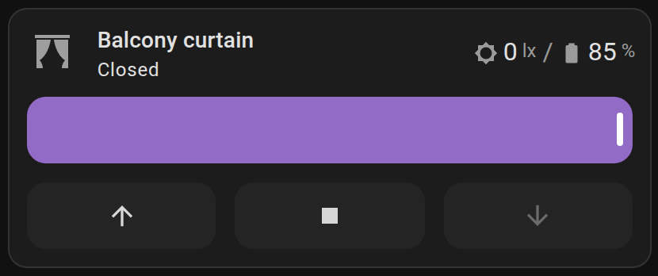

Cover position on a slider plus up/stop/down buttons — stock features, offered by the card
and removed in the Features panel. The set follows the cover's own `supported_features`.

```yaml
type: custom:horos-cover-tile
cover: cover.balcony
illuminance: sensor.balcony_illuminance
battery: sensor.balcony_battery
```

### Air — `horos-air-tile`

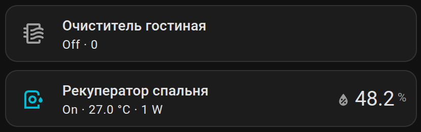

Purifier, recuperator, humidifier: the appliance itself plus what it measures.

```yaml
type: custom:horos-air-tile
appliance: fan.purifier_living_room
pm25: sensor.purifier_pm25
humidity: sensor.purifier_humidity
power: sensor.purifier_power
```

### Media — `horos-media-tile`

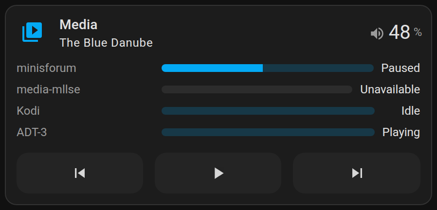

What is playing in the house, where, and how loud. Whoever is playing takes the line and
the playback buttons; every player is a row with its volume as the bar and its state at
the end.

```yaml
type: custom:horos-media-tile
players:
  - media_player.living_room_tv
  - media_player.kitchen_speaker
  - media_player.bedroom_kodi
```

### Air conditioner — `horos-ac-tile`

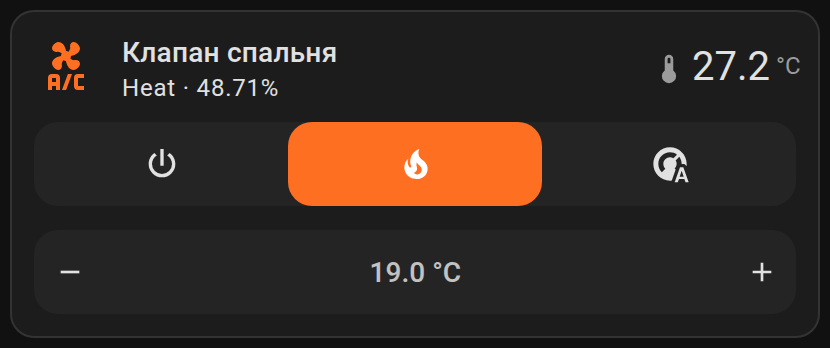

A climate unit — air conditioner, heat pump, radiator valve — with the modes and the
target as stock features. The room's own temperature and humidity are separate roles: a
unit measures the air at its intake, which is not the room.

```yaml
type: custom:horos-ac-tile
climate: climate.living_room_ac
temperature: sensor.living_room_temperature
humidity: sensor.living_room_humidity
power: sensor.ac_plug_power
```

### Heating — `horos-heating-tile`

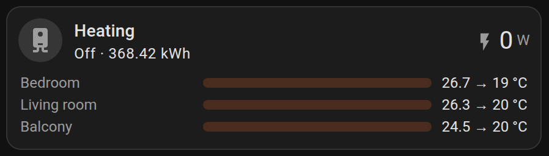

The boiler and the rooms it heats in one tile: what the boiler is doing, what it draws
and has spent, and a row per room with where it is, where it was sent, and a bar that
fills while the room is asking for heat. Demand is read from `hvac_action` only — a
thermostat that does not report it is left out of the count rather than assumed quiet.

```yaml
type: custom:horos-heating-tile
mode: sensor.boiler_mode
burner: binary_sensor.boiler_burner_active
pump: binary_sensor.boiler_pump_active
switch: switch.boiler_plug
power: sensor.boiler_plug_power
energy: sensor.boiler_plug_energy
zones:
  - entity: climate.radiator_bedroom
    name: Bedroom
  - entity: climate.radiator_living_room
    name: Living room
```

### Printer — `horos-printer-tile`

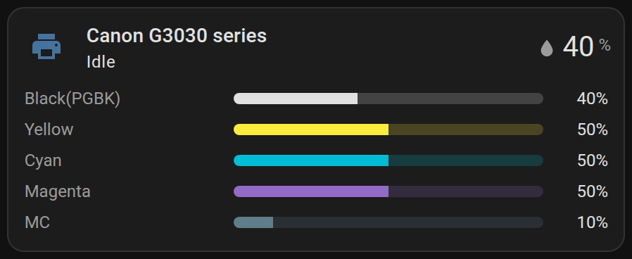

Cartridge levels in their own colours, plus the printer state. Thresholds come from the
printer's own markers, and the waste ink tank is counted the other way round — it fills
up rather than runs out.

```yaml
type: custom:horos-printer-tile
status: sensor.printer_status
cartridges:
  - sensor.printer_black
  - sensor.printer_cyan
  - sensor.printer_magenta
  - sensor.printer_yellow
```

### Vacuum — `horos-vacuum-tile`

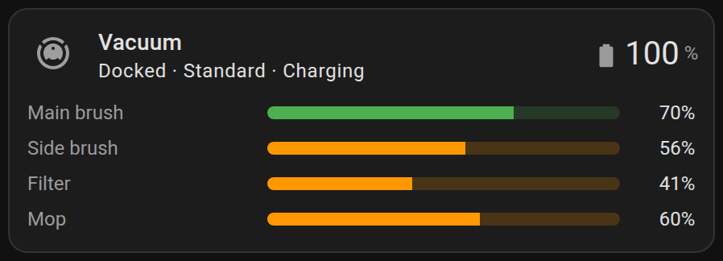

Battery and the remaining life of brushes, filter and mop.

```yaml
type: custom:horos-vacuum-tile
vacuum: vacuum.robot
battery: sensor.robot_battery
consumables:
  - entity: sensor.robot_main_brush_left
    name: Main brush
  - sensor.robot_side_brush_left
  - sensor.robot_filter_left
```

### Computer — `horos-computer-tile`

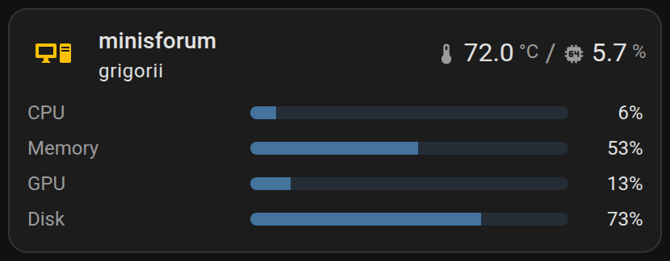

CPU, memory, GPU and disk load; in large type — the hottest of all temperature sensors.

```yaml
type: custom:horos-computer-tile
status: sensor.desktop_status
cpu: sensor.desktop_cpu_load
memory: sensor.desktop_memory_use
gpu: sensor.desktop_gpu_load
temperatures: [sensor.desktop_cpu_temp, sensor.desktop_gpu_temp]
disks: [sensor.desktop_disk_use]
```

### Server — `horos-server-tile`

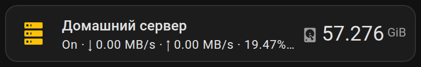

Free space, network throughput and the state of services.

```yaml
type: custom:horos-server-tile
status: binary_sensor.server_online
disk: sensor.server_disk_free
download: sensor.server_download
upload: sensor.server_upload
services: [binary_sensor.syncthing, binary_sensor.jellyfin]
```

### Person — `horos-person-tile`

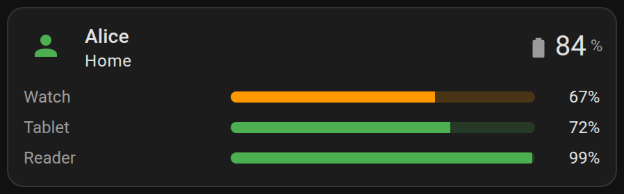

Whether someone is home, where exactly, and the battery of their devices.

```yaml
type: custom:horos-person-tile
person: person.alice
battery: sensor.alice_phone_battery
location: sensor.alice_phone_geocoded_location
devices:
  - entity: sensor.alice_watch_battery
    name: Watch
  - sensor.alice_tablet_battery
```

### Presence — `horos-presence-tile`

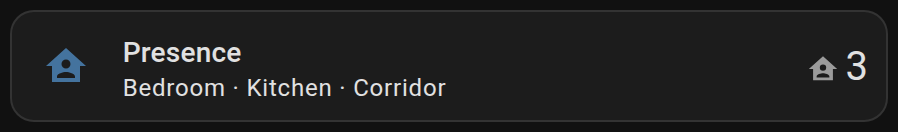

Which areas currently have someone in them.

```yaml
type: custom:horos-presence-tile
areas:
  - binary_sensor.living_room_presence
  - binary_sensor.kitchen_presence
```

### Energy — `horos-energy-tile`

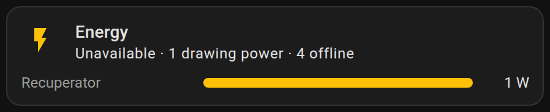

Who in the house is drawing power right now. `limit` caps how many consumers are shown.

```yaml
type: custom:horos-energy-tile
total: sensor.house_power
consumers: [sensor.boiler_power, sensor.recuperator_power]
limit: 4
```

### Batteries — `horos-batteries-tile`

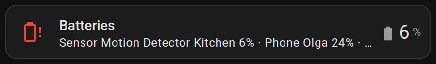

Only the batteries that are running low: below `low_below` (30% by default).

```yaml
type: custom:horos-batteries-tile
batteries: [sensor.motion_kitchen_battery, sensor.door_battery]
low_below: 30
```

### Safety — `horos-safety-tile`

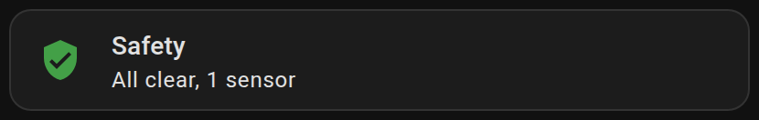

Leak, smoke, gas — and, separately, the sensors that have gone quiet.

```yaml
type: custom:horos-safety-tile
sensors: [binary_sensor.leak_kitchen, binary_sensor.smoke_hall]
```

### Not responding — `horos-offline-tile`

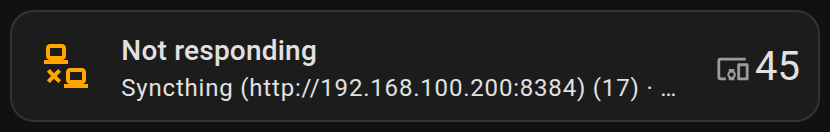

Unavailable entities grouped by device: one device, one line, not twenty. Nothing to
list — the card walks every entity itself.

```yaml
type: custom:horos-offline-tile
limit: 6
ignore: [sensor.flaky_one]
ignore_domains: [update]
```

### Alerts — `horos-alerts-tile`

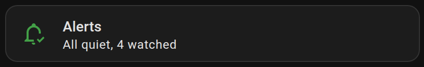

Everything worth mentioning only once it happens: a filter that wants changing, a
computer asking to reboot, a pump reporting a problem. Quiet by design — while nothing
has fired it is one line saying how many things it watches.

An alert that lost connection counts as a problem of its own: a sensor that is
`unavailable` will not fire when the thing it watches happens, and its silence looks
exactly like good news.

```yaml
type: custom:horos-alerts-tile
limit: 4
watch_offline: true
alerts:
  - entity: binary_sensor.purifier_replace_filter
    name: Filter
  - binary_sensor.desktop_required_restart
  - entity: sensor.printer_status      # anything else says what counts as fired
    name: Printer
    alert_when: [jam, error]
```

### Updates — `horos-updates-tile`

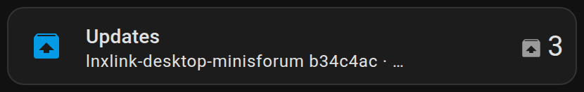

What in the house asks to be updated, one tile instead of thirty. Nothing is listed in
the config — the rule is an `update` entity that is on. Versions the owner has skipped
stay out unless `include_skipped` asks for them.

```yaml
type: custom:horos-updates-tile
limit: 4
ignore: [update.that_one_never]
include_skipped: false
```

### Tasks — `horos-tasks-tile`

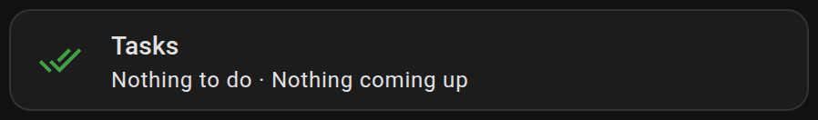

How much is left on each to-do list and what is coming up in the calendar. The bars are
shares of the longest list, so the row length answers "which list is the heavy one".

```yaml
type: custom:horos-tasks-tile
calendar: calendar.family
lists:
  - entity: todo.shopping_list
    name: Shopping
  - todo.chores
```

### Script lamp — `horos-lamp-tile`

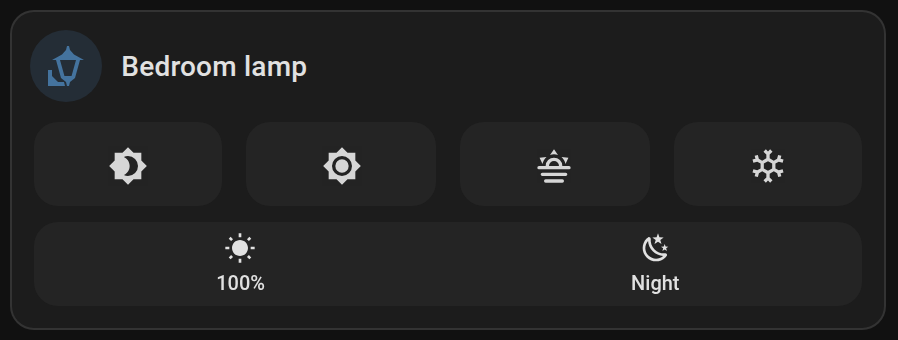

Infrared lamps and cheap strips have nothing to switch: they are a remote control, and
Home Assistant reaches them through one script per press. This card takes those scripts
as roles — `bright` and `dim` are two halves of one control, `warm` and `cold` of
another, presets are the looks the lamp can take — and draws them in Home Assistant's
own control language, the button group its cover feature uses and the segmented selector
its climate modes use.

The state is a separate, optional role: with an infrared lamp nobody knows whether it is
on, and the card does not pretend otherwise. Point it at an `input_boolean` (or a real
light) and the line, the colour and the icon start telling the truth.

```yaml
type: custom:horos-lamp-tile
name: Bedroom lamp
state: input_boolean.bedroom_lamp     # optional
power: script.lamp_on_off             # what the icon runs
bright: script.lamp_brighter
dim: script.lamp_dimmer
warm: script.lamp_warmer
cold: script.lamp_colder
presets:
  - entity: script.lamp_full
    name: 100%
    icon: mdi:white-balance-sunny
  - entity: script.lamp_night
    name: Night
    icon: mdi:weather-night
```

### Buttons — `horos-buttons-tile`

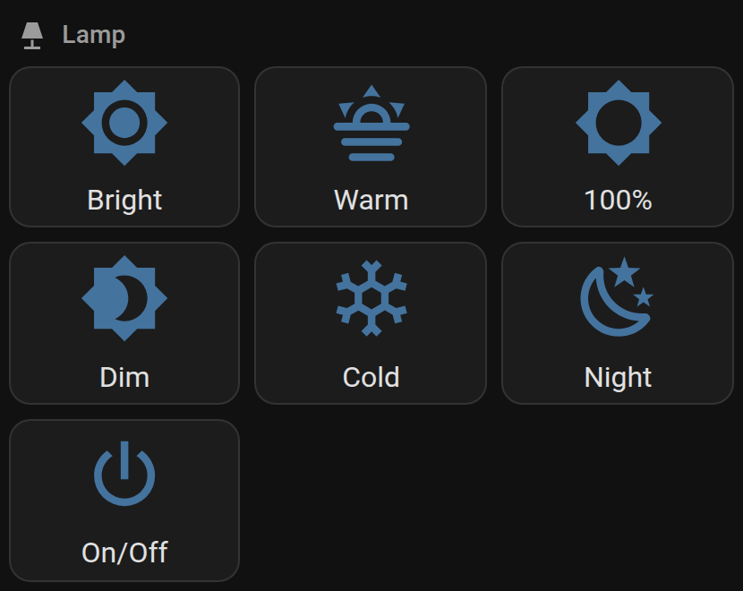

A grid of buttons that run scripts and scenes.

```yaml
type: custom:horos-buttons-tile
name: Light
icon: mdi:lamp
columns: 3
buttons:
  - entity: script.light_bright
    name: Bright
    icon: mdi:brightness-7
  - script.light_dim
  - scene.night
```

## Development

```sh
cd cards
npm install
npm run dev     # http://<this-host>:5188
npm test
npm run build   # ../dist/ha-plugins-cards.js — the file HACS installs
```

Dev mode is only for while the cards are being edited: the dashboard then loads them
straight off the development machine, with `http://<host>:5188/src/main.ts` added to the
dashboard resources. The dashboard has to be opened over **http** for that, otherwise the
browser blocks the http module as mixed content. Reloading means F5: a custom element
that is already registered cannot be redefined in a live page.

The `frontend/` folder is a clone of the home-assistant/frontend sources. It is not part
of the project and is not committed, but it is the reference for markup and design tokens.

### Deploying to your own Home Assistant

```sh
script/publish.py
```

Builds the bundle, copies it into `www/` on the Home Assistant host and updates the
dashboard resource, appending a hash of the contents to the URL. That version in the URL
is mandatory: without it HA keeps serving the cached old file and the update silently
never reaches the browser.

The host and path come from `HA_SSH_HOST` and `HA_WWW`, the URL and token from
`HOME_ASSISTANT_URL` and `HOME_ASSISTANT_KEY`.

## License

[MIT](LICENSE)
